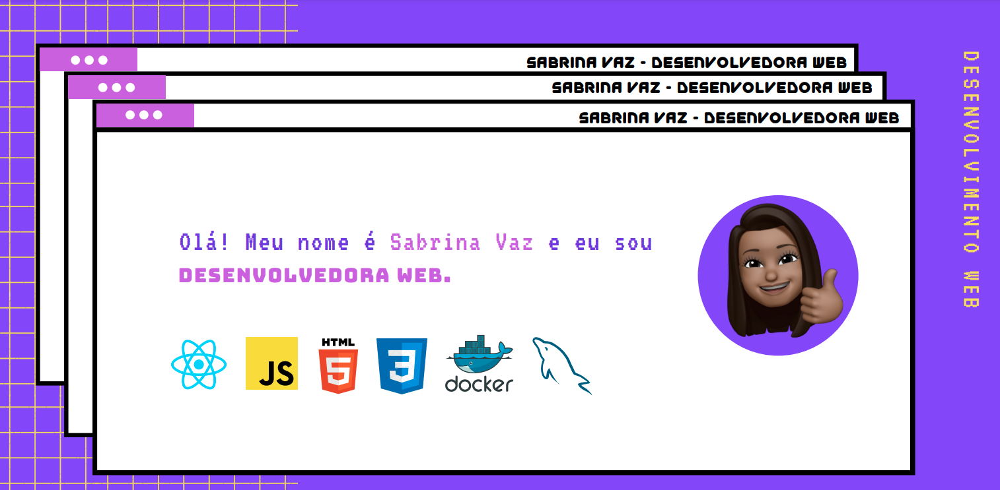

<h1 size="7"> Bem vindo ao meu GitHub! </h1>
  

  
  
   

  ## 
<h3  align="center"> 👩🏽‍💻 &nbsp;Sobre mim </h3>

- 🔺 &nbsp; Brasileira, moro em Recife, Pernambuco.
- 👩🏽‍💻 &nbsp; Desenvolvedora Web.
- 💼 &nbsp; Advogada especialista em Direito digital e Proteção de Dados.
- 🐈🐈 &nbsp; Mãe de pet.
  
  ## 

<h3> 🛠 Stacks</h3>

  
    
  
	

  
  
  

##
<h3  align="center"> ℹ️ Stats </h3>

  
  

